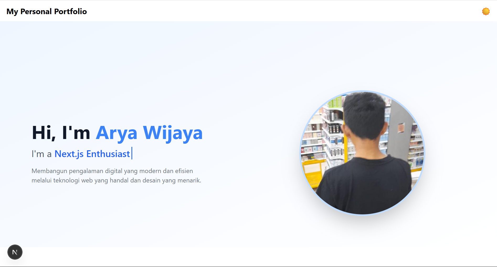

# ✨ Modern Personal Portfolio - Built with Next.js 15 + Tailwind CSS 3

Ini adalah proyek website **portofolio pribadi modern** yang dibuat dengan [Next.js](https://nextjs.org), dirancang untuk menampilkan keahlian, tools, dan proyek dengan tampilan yang clean, interaktif, dan responsif.

Website ini menampilkan:

- Hero section dengan efek ketik dinamis
- Daftar tools yang digunakan dengan animasi hover
- Galeri project dengan pop-up detail
- Sertifikat dan pengalaman
- Tampilan gelap (dark mode) sebagai default
- Efek partikel interaktif untuk estetika visual

## 🚀 Teknologi & Tools

Proyek ini dibangun dengan teknologi modern berikut:

- **[Next.js 15](https://nextjs.org/)** - Framework React modern untuk SSR, SSG, dan routing berbasis file
- **[Tailwind CSS v3](https://tailwindcss.com/)** - Utility-first CSS framework
- **[TypeScript](https://www.typescriptlang.org/)** - Superset dari JavaScript yang ditambahkan tipe
- **[Framer Motion](https://www.framer.com/motion/)** - Animasi smooth dan interaktif
- **[react-tsparticles](https://github.com/tsparticles/react)** - Efek partikel di background
- **[Lucide Icons](https://lucide.dev/)** - Ikon open source modern
- **[Vercel](https://vercel.com/)** - Platform deployment untuk Next.js (sudah ter-deploy!)

## 🧠 Struktur Proyek

```bash
/src
 ┣ /app            # Entry point halaman Next.js 15 (App Router)
 ┣ /components     # Komponen utama: Hero, Tools, Projects, Certificates, dll
 ┣ /public         # Aset publik seperti gambar proyek dan tools
 ┣ /styles         # Global stylesheet
 ┗ /lib            # Utility/helper function
```
